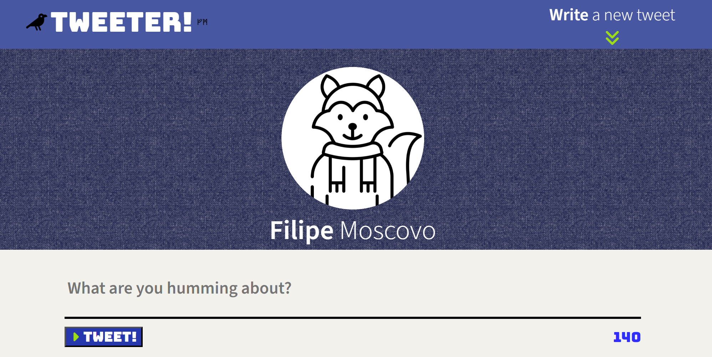
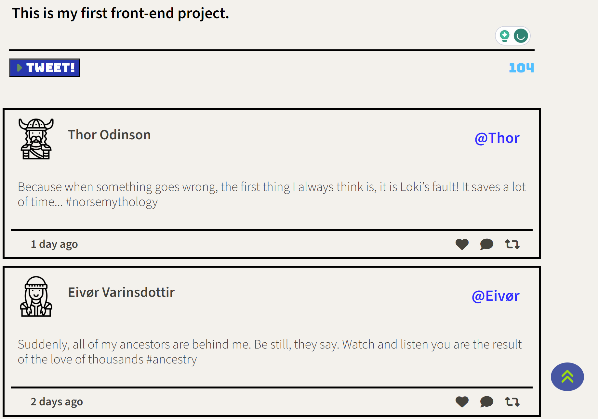

# Tweeter

Tweeter is a simple, single-page Twitter clone developed by Lighthouse Labs. This web application uses HTML, CSS, JS, jQuery and AJAX on the client-side, and Node and Express on the server-side.

## Features

- Post new tweets.
- See all tweets in reverse-chronological order.
- Back-to-top button that appears after scrolling down.

## Video and Screenshots

### Video

Here's a video demonstration of how Tweeter works:

[[Tweeter Demo Video])](https://youtu.be/maf55bJEvMY)

### Screenshots

Here are some screenshots of the application:

## Getting Started

1. Install dependencies using the `npm install` command.
2. Start the web server using the `npm start` command. The app will be served at <http://localhost:8080/>.
3. Go to <http://localhost:8080/> in your browser.

## Dependencies

- Express
- Node.js
- body-parser
- Chance
- md5

## Dev Dependencies

- Nodemon

